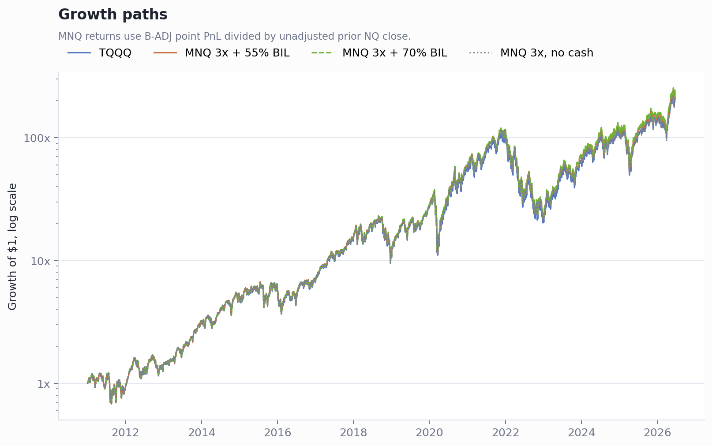
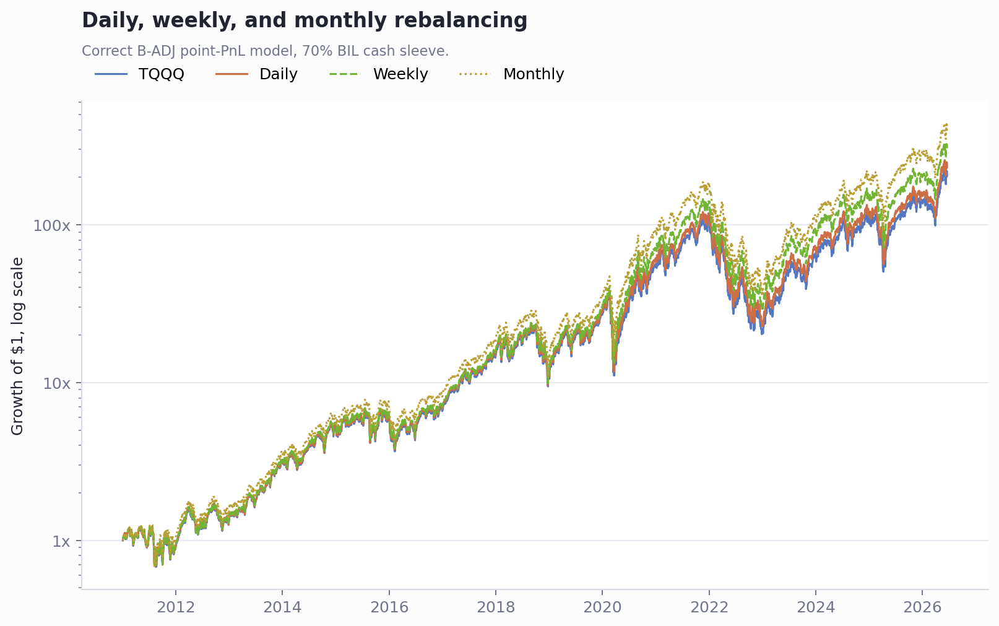

# 指数杠杆与波动率研究

```text
nq-leverage/              # TQQQ vs MNQ/NQ 合成 3x 纳指敞口
qqq-volatility/           # QQQ 历史波动率状态
optimal-leverage-rates/   # 历史利率条件下 NDX/SPX 最佳杠杆率
```

## 1. TQQQ vs MNQ/NQ 杠杆研究

核心结论：

- 不计现金收益时，MNQ/NQ 每日 3x 并没有显著碾压 TQQQ。2011-01-03 到 2026-06-18，TQQQ 最终约 `216.10x`，MNQ 每日 3x 不吃现金收益约 `210.01x`。
- MNQ 方案的主要优势来自“期货保证金之外的闲置现金可吃短债收益”。用 BIL 作为现金收益代理时，MNQ 每日 3x + 55% BIL 到 `236.33x`，MNQ 每日 3x + 70% BIL 到 `244.07x`。
- 2022 年加息后，MNQ + 短债相对 TQQQ 的优势更明显。
- 再平衡频率上，月平衡历史收益最高，但收益主要来自上涨趋势中的杠杆漂移；周平衡更像实盘可执行的折中。





注意：这一部分依赖已清洗的 NQ B-ADJ/非 B-ADJ、TQQQ、BIL 输入数据。为了减少仓库数据体积，`nq-leverage/data/` 没有随仓库保存；如需复现，需要把对应输入文件外部放回该目录。

## 2. QQQ 波动率研究

核心结论：

- 该研究用 Yahoo 调整收盘价计算 QQQ 的 20 个交易日滚动年化波动率。
- 截至 2026-07-02，QQQ 20 日滚动年化波动率为 `34.8%`。
- 这个水平已经高于 1999 年以来全历史样本的高波动阈值 `27.6%`，属于明确的高波动状态。
- 全历史最大高波动阶段仍是互联网泡沫破裂期：2000-09-06 到 2003-02-06，持续 603 个交易日，平均波动率 `48.0%`，峰值 `99.1%`。


脚本默认可从 Yahoo Chart API 下载 QQQ 数据，不需要仓库保存 raw JSON。若要输出审计 CSV，可运行时加 `--write-tables`，生成的 CSV 默认不纳入版本管理。

## 3. 历史利率条件下 NDX/SPX 最佳杠杆率

这项研究用 NDX/SPX 指数价格收益和 Yahoo `^IRX` 13 周国库券收益率作为现金/融资代理，模拟每日再平衡杠杆，并加入年化 `0.9%` 费率拖累。

样本起点：

- `NDX`：1985-10-02
- `SPX`：1985-01-03
- 利率代理 `^IRX`：1985-01-02

终点 2026-07-02

```text
strategy_return = L * index_return + (1 - L) * rf_daily - fee_daily
```

其中 `fee_daily` 为年化 `0.9%` 按 252 个交易日折算后的每日费用。

下表先给出同一收益序列下的 1x 指数价格路径作为 baseline；baseline 不扣 `0.9%` 费率，杠杆策略扣费。

| 标的 | 1x 指数倍数 | CAGR | 最大回撤 |
|---|---:|---:|---:|
| NDX | 261.54x | 14.6% | -82.9% |
| SPX | 45.25x | 9.6% | -56.8% |

最大 CAGR 杠杆策略相对 baseline 的变化：

| 标的 | 最大 CAGR 杠杆 | 策略倍数 | 策略 CAGR | 策略最大回撤 | 相对 1x 指数 |
|---|---:|---:|---:|---:|---|
| NDX | 2.05x | 889.88x | 18.1% | -99.0% | 终值 `3.40x`，CAGR `+3.5pct`，回撤加深 `16.1pct` |
| SPX | 2.25x | 99.94x | 11.7% | -94.1% | 终值 `2.21x`，CAGR `+2.1pct`，回撤加深 `37.3pct` |

重要限制：这里使用的是 NDX/SPX 价格指数，不是总回报指数；这会低估含股息再投资的指数回报。模型已扣除 `0.9%` 年化费率，但没有计入税、滑点、佣金、融资利差、保证金规则变化或强平机制。

## 复现

安装依赖：

```powershell
python -m pip install -r requirements.txt
```

重新生成 QQQ 全历史波动率图：

```powershell
Set-Location qqq-volatility
python scripts\qqq_volatility_study.py `
  --prefix qqq_1999_daily `
  --scope "the full daily history since 1999" `
  --start 1999-03-10
```

重新生成 NDX/SPX 最佳杠杆图：

```powershell
Set-Location optimal-leverage-rates
python scripts\optimal_leverage_rates.py
```

如需输出 CSV 审计表：

```powershell
python scripts\optimal_leverage_rates.py --write-tables
```

NQ 杠杆研究需要外部数据文件放回 `nq-leverage/data/input/` 后再运行：

```powershell
Set-Location nq-leverage
python final_tqqq_mnq_badj_analysis.py
python final_rebalance_badj_analysis.py
```
