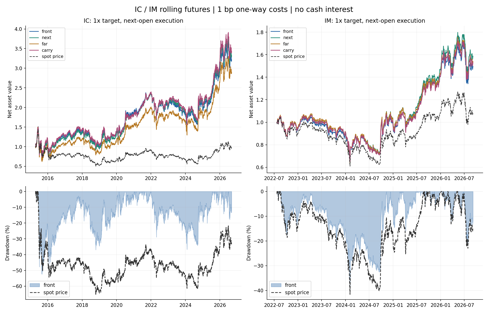

# IC / IM 滚贴水策略回测

研究快照：2026-09-07。检验长期持有中证500、中证1000股指期货能否通过贴水获得超额收益，以及该收益是否与股市无关。

## 结论

**历史样本存在超额收益，但长期持有IC/IM仍承担接近1的股票市场beta，不是市场中性策略。**

| 基准策略 | 年化复合收益 | 年化波动 | 夏普 | 最大回撤 |
|---|---:|---:|---:|---:|
| IC近月，2015-04-16起 | 10.81% | 29.19% | 0.44 | -52.42% |
| IM近月，2022-07-22起 | 10.24% | 26.02% | 0.44 | -39.41% |

截至2026-09-07。首日为初始资金记录，下一交易日开始持仓。1倍目标名义敞口，前一日决策、次日开盘成交，单边综合交易成本1bp，不计现金利息，夏普扣除年化2%无风险机会成本。每日按昨日权益调整小数手仓位。

- 日收益与对应价格指数的相关性：IC 0.941，IM 0.975；回归beta分别约1.072和1.007。
- 2倍杠杆的最大回撤扩大至IC 82.74%、IM 65.62%，年化收益仅约12.55%、13.70%。这是未执行强平的理论结果。
- IC的价格指数回归alpha从早期高位下降，2023年以来约6%/年；全样本约11.80%/年不能直接外推。
- 固定15%保证金情景下，5倍敞口出现追保触发。历史保证金、开仓限制和真实强平尚未逐日复原。
- 现货基准是价格指数，不含分红。回归alpha不是已实现的纯套利收益。

详见[结论记录](docs/CONCLUSIONS.md)和[完整报告](outputs/回测报告.md)。[HTML报告](outputs/回测报告.html)内嵌图表，可直接在浏览器离线打开。



## 仓库结构

- `docs/CONCLUSIONS.md`：结论、适用范围及下一轮研究事项。
- `work/prepare.py`：从原始ZIP清洗期货数据并补充现货指数。
- `work/backtest.py`：规则、收盘成交参照模型、统计函数。
- `work/extra_analysis.py`：前日信号、次日开盘成交的主模型及敏感性分析。
- `work/report.py`：生成报告、图表和独立损益校验。
- `work/package.py`：生成便于分享的ZIP研究包，ZIP不纳入Git。
- `work/sh000*.json`：现货接口原始响应快照。
- `outputs/futures_clean.csv`、`outputs/spot_indices.csv`：复现输入。
- `outputs/open_*.csv`：主模型结果。没有`open_`前缀的对应表主要是收盘成交参照，使用时不要混用。
- `outputs/source_manifest.csv`、`outputs/data_audit.json`、`outputs/validation.json`：来源、清洗审计、计算校验。

保留研究时的`work/`和`outputs/`目录布局，便于直接重跑原脚本。原始期货ZIP仍在桌面`cffex_history_zip`，不重复纳入仓库，以SHA-256清单记录来源。

## 离线复现

在仓库根目录执行。安装依赖需要网络，依赖已安装后以下回测步骤无需联网：

```powershell
python -m venv .venv
.venv/Scripts/python.exe -m pip install -r requirements.txt
.venv/Scripts/python.exe work/backtest.py
.venv/Scripts/python.exe work/extra_analysis.py
.venv/Scripts/python.exe work/report.py
```

如需重新清洗，先核对`work/prepare.py`中的`SRC`和截至日期，再运行该脚本；该步骤会联网拉取指数行情。日期及报告中的叙述是本次研究快照，扩大样本时须同步更新，不能只替换数据后保留原结论文字。

## 验证与限制

原始期货共138个ZIP，IC 2,772日、IM 1,002日，合计15,096条合约日记录。没有重复日期合约键、无效OHLC、结算价衔接异常或相对现货交易日缺失。逐条独立核验18,860条主模型日损益，同时校验净值复利、前日可用合约和定仓信息。

当前结果假设能按日线开盘价加统一成本成交，基准允许小数手。未逐日复原历史保证金、交易费率、开仓限制和盘口成交；保证金表是固定比例压力测试。基差对冲诊断未包含借券、分红补偿及融资成本，不能当作可交易的市场中性策略。完整来源链接和限制见报告。
