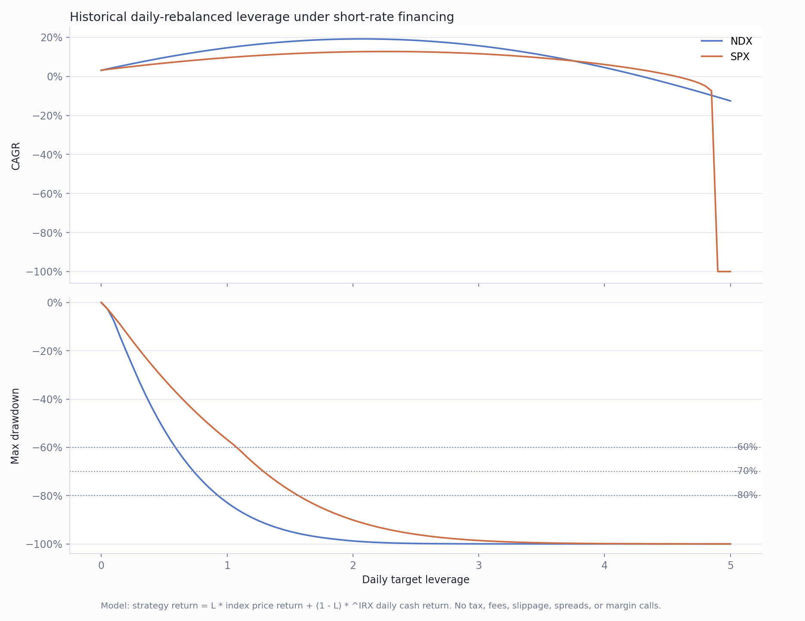

# 历史利率条件下的 NDX/SPX 最佳杠杆率

本研究用 NDX/SPX 指数价格收益和 Yahoo `^IRX` 13 周国库券收益率，估算不同每日再平衡杠杆在历史短端利率条件下的表现。

## 主要结论

最大化历史 CAGR 会选择很高的杠杆：

| 标的 | 最大 CAGR 杠杆 | CAGR | 最大回撤 |
|---|---:|---:|---:|
| NDX | 2.05x | 19.2% | -99.0% |
| SPX | 2.25x | 12.7% | -93.6% |

但这类路径有接近清零的历史回撤，更适合作为理论上限，不适合作为直接配置建议。回撤约束下的结果更实用：

| 回撤约束 | NDX 最佳杠杆 | SPX 最佳杠杆 |
|---|---:|---:|
| 最大回撤不超过 60% | 0.55x | 1.05x |
| 最大回撤不超过 70% | 0.70x | 1.25x |
| 最大回撤不超过 80% | 0.90x | 1.55x |



## 方法

```text
strategy_return = L * index_return + (1 - L) * rf_daily
```

- 数据源：Yahoo Finance Chart API。
- 标的：`^NDX`、`^GSPC`。
- 利率代理：`^IRX`，转换为每日现金/融资收益。
- 杠杆网格：0x 到 5x，步长 0.05x。
- 默认只保存图表，不保存原始数据和 CSV 表格。

## 复现

```powershell
python scripts\optimal_leverage_rates.py
```

如需缓存原始 Yahoo JSON：

```powershell
python scripts\optimal_leverage_rates.py --cache-data
```

如需输出 CSV 审计表：

```powershell
python scripts\optimal_leverage_rates.py --write-tables
```

## 限制

这里使用的是价格指数，不是总回报指数；这会低估含股息再投资的 SPX 实现。模型没有计入税、佣金、滑点、融资利差、ETF 费用、保证金规则变化或强平机制。
