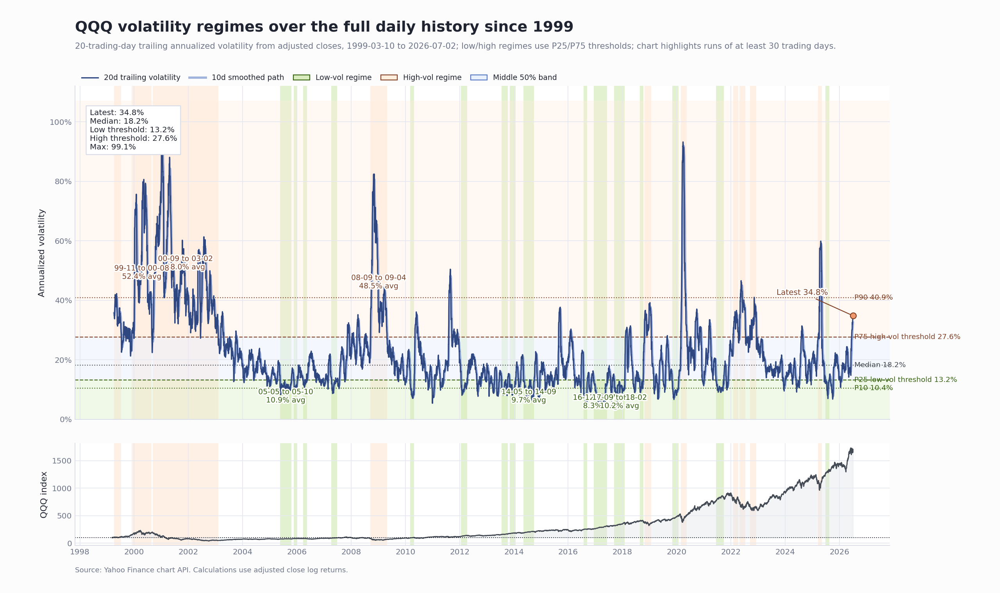

# QQQ 波动率研究

本研究计算 QQQ 调整收盘价的 20 个交易日滚动年化波动率，并按样本内分位数划分低波动/高波动区间。

## 主要结论

- 截至 2026-07-02，QQQ 20 日滚动年化波动率为 `34.8%`。
- 这个水平已经高于 1999 年以来全历史样本的高波动阈值 `27.6%`，属于明确的高波动状态。
- 全历史里最重要的高波动阶段仍是互联网泡沫破裂期：2000-09-06 到 2003-02-06，持续 603 个交易日，平均波动率 `48.0%`，峰值 `99.1%`。
- 低波动阶段里，2016-12-09 到 2017-06-08 是全历史最长低波动区间之一，持续 124 个交易日，平均波动率 `8.3%`。



## 方法

- 数据源：Yahoo Finance Chart API。
- 价格：调整收盘价。
- 收益：日对数收益。
- 波动率：20 个交易日滚动标准差，按 252 个交易日年化。
- 低波动阈值：样本内 P25。
- 高波动阈值：样本内 P75。
- 相隔不超过 3 个交易日的相邻状态段会合并；少于 10 个交易日的状态段不纳入段表。

## 复现

脚本默认在本地没有 `raw_data` 时直接从 Yahoo 下载，不需要仓库保存原始 JSON。

```powershell
python scripts\qqq_volatility_study.py `
  --prefix qqq_1999_daily `
  --scope "the full daily history since 1999" `
  --start 1999-03-10
```

如需生成 CSV 审计表：

```powershell
python scripts\qqq_volatility_study.py --write-tables
```
